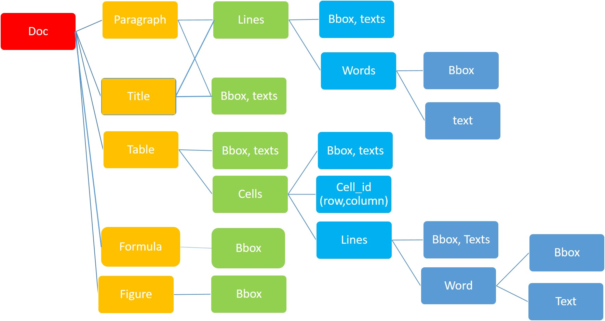

# SDL: Synthetic Document Layout dataset

SDL is the project that synthesizes document images. It facilitates multiple-level labeling on document images and can generate in multiple languages.
### Sample image


### Structure of data


### Quick start
```
python flexible_layout.py --config_file configs/page.yaml
```

### Instruction to run data generation 
Go to [instruction](instruction.md)

### Visualization of the result
```
python data_manipulation/visualize.py
```

### Vietnamese 300000 images link: 
Release soon

### Paper
https://arxiv.org/abs/2106.15117
